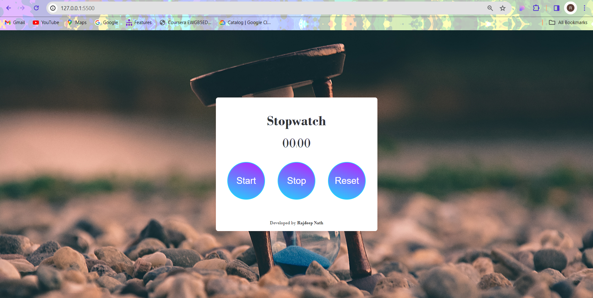

# PRODIGY_WD_02
# Stopwatch

A simple stopwatch web application developed by Rajdeep Nath.

## Table of Contents
- [Introduction](#introduction)
- [Features](#features)
- [Usage](#usage)
- [Screenshots](#screenshots)
- [Contributing](#contributing)
- [License](#license)

## Introduction
This is a basic stopwatch web application built using HTML, CSS, and JavaScript. It allows users to start, stop, and reset the timer. The background image enhances the visual appeal of the stopwatch.

## Features
- Start the stopwatch.
- Stop the stopwatch.
- Reset the stopwatch to zero.

## Usage
1. Open the `index.html` file in a web browser.
2. Use the "Start," "Stop," and "Reset" buttons to control the stopwatch.

## Screenshots

## Contributing
If you'd like to contribute to this project, feel free to open issues or submit pull requests. Contributions are always welcome!

## License
This project is licensed under the [MIT License](LICENSE).

---

**Developed by Rajdeep Nath**
